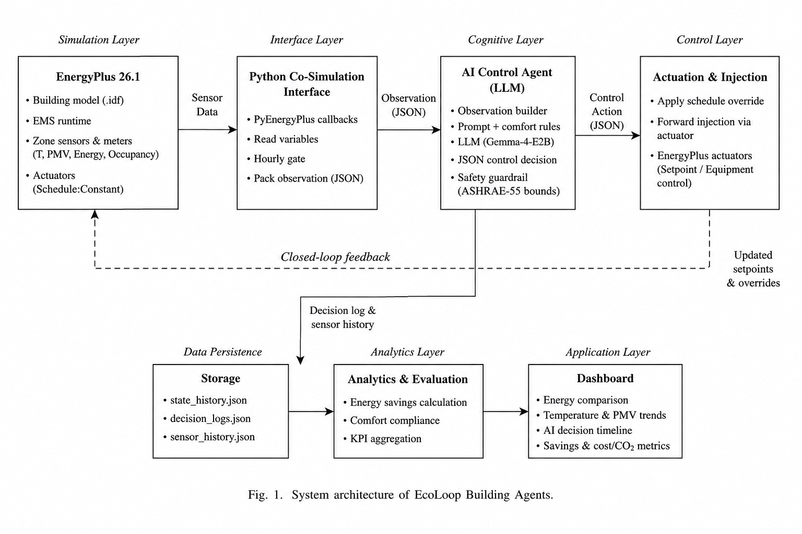
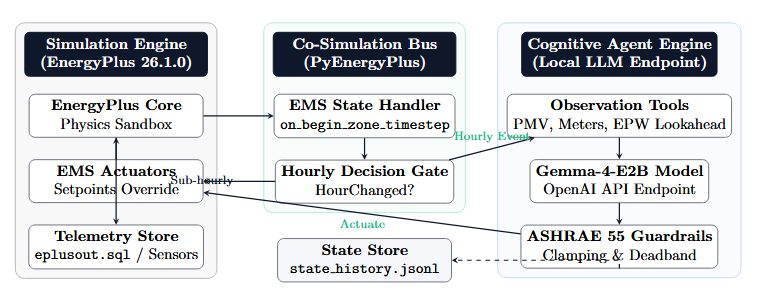

# Eco - Loop Building Agents — System Architecture

**Honeywell Hackathon Physical AI PoC** | EnergyPlus 26.1.0 · Gemma-4-E2B LLM

---

Candidate ID: 20518043

---

## 1. Problem Background

Commercial buildings account for ~40% of global energy consumption. Traditional BMS use rigid rule-based schedules — static cooling/heating setpoints that cannot adapt to weather, occupancy, or grid conditions. Key failure modes:

- **Overcooling waste** — chilled water loops run unnecessarily during mild conditions
- **Thermal comfort ignored** — single dry-bulb sensor misses humidity, radiant temp, metabolic load
- **No lookahead** — reactive control absorbs heat loads only after thermal mass is already saturated

---

## 2. System Architecture



EcoLoop pairs a physics simulation engine (EnergyPlus) with a local open-source LLM (Gemma-4-E2B) to create a continuous, closed-loop supervisory controller. The LLM ingests live sensor telemetry, reasons over a 6-hour weather forecast, and injects HVAC setpoints directly back into the simulation every hour.

---

## 3. Co-Simulation Topology



The co-simulation bus is implemented as an EnergyPlus `PythonPlugin`. It fires on every zone timestep and routes control through three stages:

| Stage | Component | Role |
|-------|-----------|------|
| 1 | **EnergyPlus Core** | Physics sandbox — solves heat balance, tracks zones |
| 2 | **Co-Simulation Bus** (`plugin.py`) | Intercepts timestep, gates LLM calls hourly |
| 3 | **Cognitive Engine** (`agent.py`) | LLM reasons over telemetry, outputs JSON setpoints |
| 4 | **Safety Guardrails** (`guardrail.py`) | Clamps outputs to ASHRAE 55 bounds before actuation |

---

## 4. Cognitive Engine

The agent is called via OpenAI-compatible REST (`/v1/chat/completions`) against the local Gemma-4-E2B server. Each call receives:

- Current zone temperature & PMV comfort index
- Cumulative HVAC energy consumption
- 6-hour outdoor temperature forecast from EPW file
- Last 3 decisions (rolling memory to prevent setpoint hunting)

The system prompt enforces strict JSON output:

```json
{"heating_sp": 21.0, "cooling_sp": 24.0, "reasoning": "brief explanation"}
```

Actuation targets `Schedule:Constant` objects (`Clg-SetP-Sch`, `Htg-SetP-Sch`) directly via EMS actuator handles.

---

## 5. Safety Guardrails (ASHRAE 55)

All LLM-proposed setpoints pass through deterministic clamping before being applied:

- **Heating**: clamped to `[18.0°C, 24.0°C]`
- **Cooling**: clamped to `[22.0°C, 28.0°C]`
- **Deadband**: `cooling − heating ≥ 2.0°C` enforced to prevent simultaneous coil operation

This layer is fully deterministic — the simulation cannot be destabilised regardless of LLM output.

---

## 6. Latency Optimisations

The IDF runs at `Timestep 4` (15-min intervals → 672 timesteps over 7 days). Without gating, 672 LLM calls would take ~50 minutes.

| Optimisation | Effect |
|---|---|
| **Hourly decision gate** — LLM called only on hour change | 4× fewer calls (672 → 168) |
| **`max_tokens: 128`** — schema requires ~35 tokens | Inference ~1.0–1.5s per call |
| **`timeout=10s`** with `last_good` fallback | No EnergyPlus crash on LLM timeout |
| **Design-day guard** — skip actuation when `env_num < 3` | Clean HVAC sizing, no distortion |

---

## 7. Results (July 1–7, Chicago Summer)

| Metric | Baseline | EcoLoop AI | Change |
|--------|----------|------------|--------|
| Cooling Energy (kWh) | 173.70 | **133.16** | **−23.34%** |
| Avg Zone Temp (°C) | 22.96 | 23.35 | +0.39°C (less overcooling) |
| Avg PMV Index | −0.66 | **−0.55** | **+16.1% toward neutral** |
| LLM Decisions | 0 | 168 | Hourly over 7 days |
| Total Runtime | 5.2s | 228.4s | <4 min end-to-end |

Energy savings came from **eliminating overcooling**: the baseline's static 24°C setpoint drove zone temps down to 22.96°C (PMV −0.66, too cold). EcoLoop floated setpoints to 26–27°C during peak afternoon hours, raising avg zone temp to 23.35°C and shifting PMV to −0.55 — closer to comfort neutral — while cutting cooling electricity by 40.54 kWh.
